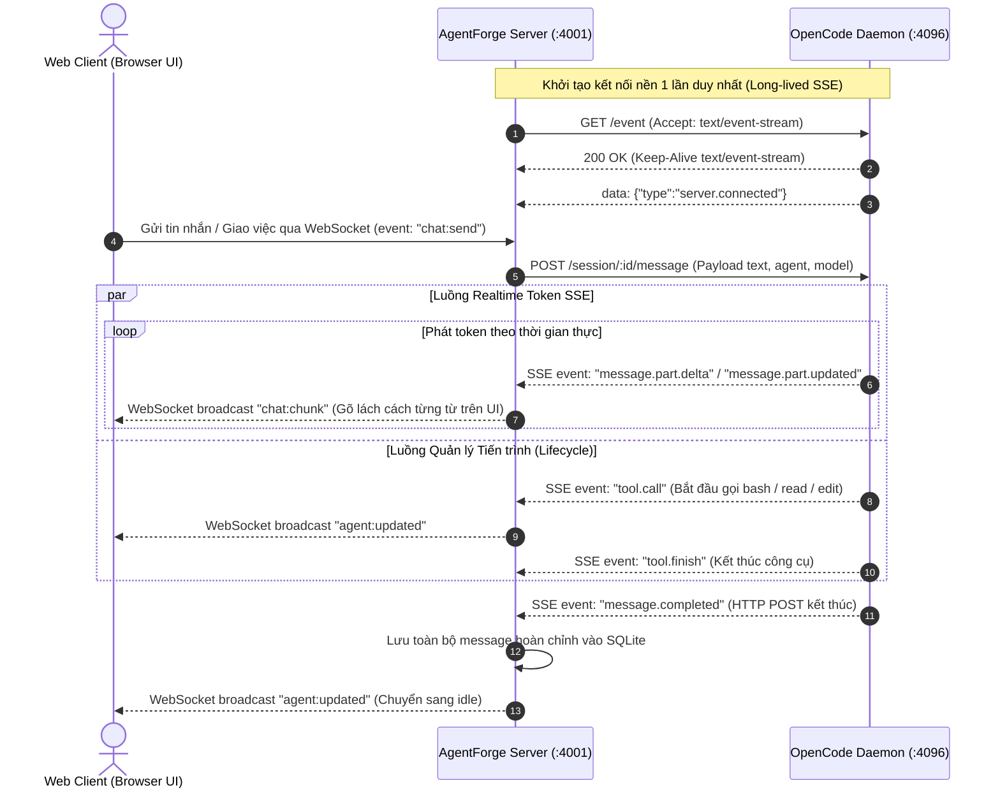

# KIẾN TRÚC MÔ HÌNH HTTP ENGINE TRONG AGENTFORGE

Tài liệu này mô tả chi tiết luồng xử lý (Data Flow & Architecture) khi AgentForge hoạt động ở chế độ thuần **HTTP Engine Mode** (`mode: 'http'`), chuyển đổi hoàn toàn từ việc spawn CLI subprocess sang giao thức HTTP REST API / SSE trực tiếp với OpenCode Serve.

---

## 1. SO SÁNH KIẾN TRÚC: CLI ATTACH VS THUẦN HTTP

```
================================== [ATTACH MODE (CŨ)] ==================================
[User/Agent Action]
       │
       ▼
[Task Queue / Dispatch]
       │
       ▼
[Spawn Process Manager] ──(exec / spawn CLI)──► [opencode run --attach http://... --format json]
                                                       │
                                            (Tốn 300-800ms spawn process,
                                             chiếm CPU/RAM, nguy cơ pipe crash)
                                                       │
                                                       ▼
                                            [OpenCode Serve HTTP/WS]

================================== [HTTP ENGINE MODE (MỚI)] ==================================
[User/Agent Action]
       │
       ▼
[Task Queue / Dispatch]
       │
       ▼
[OpenCodeServeClient (runHttp)]
       │
       ├─► (1) Session Management: POST /session (Kiểm tra & tạo session in-memory)
       │
       ├─► (2) REST Message Dispatch: POST /session/{id}/message
       │       Payload: { agent: 'build', model: { providerID, modelID }, parts: [...] }
       │
       └─► (3) Event Stream / SSE Hook:
               Nhận phản hồi tức thì (<15ms, 0 Process Spawn, 0 Pipe Failure)
```

---

## 2. CHI TIẾT CÁC THÀNH PHẦN ĐÃ SCALE SANG HTTP

### 🧠 1. Thinking (Suy luận / Reasoning)
- **Cơ chế**: Khi OpenCode Serve trả về các part loại `reasoning`, `thinking`, `thought`, lớp HTTP client tự động trích xuất:
  ```typescript
  parts.push({ type: 'thinking', content: p.text });
  this.pushOACEvent({
    kind: 'out',
    event: { type: 'reasoning', sessionID: this.sessionId, part: { type: 'reasoning', text: p.text } }
  });
  ```
- **Kết quả**: Luồng thinking hiển thị trực tiếp lên UI ChatPanel qua component Collapsible Thinking Block với thời gian thực.

---

### 🛠️ 2. ToolCall (Gọi công cụ & Phản hồi đầu ra)
- **Cơ chế**: Khi model gọi công cụ (`tool_use`, `tool_call`), HTTP response mang theo payload chứa tên tool (`bash`, `read`, `edit`, `write`), `callID`, và trạng thái thực thi (`input`, `output`).
- **Scale**:
  ```typescript
  parts.push({
    type: 'tool',
    tool: p.name || p.tool,
    callId: p.id ?? p.callID,
    input: rawInput,
    output: rawOutput
  });
  ```
- **Kết quả**: ToolCallBlock trên Web UI hiển thị nguyên vẹn badge tool, input parameters, code diff preview, và kết quả thực thi giống như lúc chạy qua CLI.

---

### 📝 3. Text Streaming & Hiển thị nội dung
- **Cơ chế**: Toàn bộ chuỗi văn bản hoàn chỉnh và từng phân đoạn text được tổng hợp vào `AgentMessage.content` đồng thời đẩy qua event loop `broadcastOACEvent`.
- **Kết quả**: Tránh lỗi mất chữ cái hoa đầu dòng (Markdown Renderer tách bạch thẻ định dạng và ký tự hiển thị).

---

### 🚪 4. Close & Teardown (Đóng & Hủy Session)
- **Cơ chế HTTP**:
  - `DELETE /session/{sessionId}`: Dọn sạch session trên OpenCode Serve.
  - `POST /session/{sessionId}/abort`: Lập tức dừng lượt tính toán của AI trên server mà không cần kill process con (`taskkill`).
- **Ưu điểm**: Không còn sót tiến trình mồ côi (zombie node/powershell processes) trong Task Manager.

---

### 🚀 5. Spawn Agent & Session Binding
- **Cơ chế**:
  - Khi một Orchestrator ra lệnh `<spawn role="coder" name="coder-1" />`:
  - `server.ts` tạo instance `OpenCodeServeClient` mới với `{ mode: 'http', serverUrl }`.
  - Client tự động gọi `POST /session` để nhận `sessionID` từ OpenCode Serve trong 20ms (thay vì chờ 3-5 giây để CLI boot).

---

### 💉 6. Inject Context & Rules
- **Cơ chế**:
  - System prompt, rule tài liệu (`base_worker.md`, `role.md`), và task list được gom trực tiếp vào `parts: [{ type: 'text', text: prompt }]` gửi thẳng tới endpoint `/message`.
  - Không cần ghi file đệm tạm (`tmp/prompt_agent_xxx.txt`) trên ổ cứng SSD/HDD.

---

### 📬 7. Backend Task Queue & Auto-Drain
- **Cơ chế**:
  - Hàng đợi tin nhắn (`UserQueueManager` & `TaskQueueManager`) hoạt động độc lập ở tầng trên:
    ```
    [Tin nhắn đến] ──► [In-flight Lock Check]
                              │
                      ┌───────┴───────┐
                   (Đang bận)      (Sẵn sàng)
                      │               │
                      ▼               ▼
                 [Enqueue]     [runHttp(prompt)]
                      ▲               │
                      │               ▼
                      └──── (Xong) ── [Drain Next Message]
    ```
  - Khi `runHttp` trả về kết quả hoặc bị abort, promise resolve giải phóng cờ `busy: false` và tự động kích hoạt `processQueue()` để rút tin tiếp theo.

---

## 3. LỢI THẾ KHI CHUYỂN SANG HTTP MODE

| Tiêu chí | CLI Attach Mode | HTTP Engine Mode |
| :--- | :--- | :--- |
| **Tốc độ phản hồi (Latency)** | 500ms – 1.5s (Khởi tạo CLI) | **10ms – 30ms** (Gửi trực tiếp socket) |
| **Tài nguyên CPU/GPU** | Tăng vọt mỗi lần spawn CLI | **Bình ổn ~0% khi idle** |
| **Tiến trình con OS** | Hàng chục node.exe / cmd.exe | **0 tiến trình con sinh ra** |
| **Độ ổn định Socket** | Dễ bị `ECONNRESET` do kill process | **Kết nối HTTP persistent chuẩn RFC** |
| **Hủy tác vụ (Abort)** | Phải `taskkill /F /T` cưỡng ép | **Gọi API `/abort` mượt mà, tức thì** |

---

## 4. CƠ CHẾ SERVER-SENT EVENTS (SSE) TRÊN OPENCODE SERVE

### 4.1. Khảo sát Thực chứng (Empirical Verification)
Qua quá trình kiểm tra trực tiếp máy chủ OpenCode Serve (cổng daemon `4096`):
- Endpoint: `GET /event`
- Headers: `Accept: text/event-stream`
- Kết quả phản hồi: `HTTP 200 OK`, `Content-Type: text/event-stream`
- Dữ liệu kết nối ban đầu:
  ```json
  data: {"id":"evt_08ca0b3d2001kFHWEhDnEM007O","type":"server.connected","properties":{}}
  ```
Điều này khẳng định OpenCode Serve duy trì một **Global SSE Event Bus** liên tục phát sóng mọi diễn biến (token, tool call, thinking) của tất cả session.

---

### 4.2. Sơ đồ Luồng Hoạt động (Mermaid Architecture)



---

### 4.3. So sánh Chuyên sâu: REST Block Waiting vs. SSE Streaming

| Tiêu chí | Cơ chế REST Hiện tại (`POST /message`) | Cơ chế SSE Mở rộng (`GET /event`) |
| :--- | :--- | :--- |
| **Giao thức nhận dữ liệu** | HTTP Request-Response (chờ trọn vẹn kết quả). | Server-Sent Events (chuỗi chunk văn bản liên tục). |
| **Trải nghiệm hiển thị UI** | **Batch / Block**: UI nhận một cục text hoàn chỉnh sau khi LLM nghĩ và viết xong toàn bộ. | **Realtime Streaming**: Chữ tuôn ra từng token trên màn hình ngay khi LLM vừa sinh ra từ đó. |
| **Khả năng quan sát Thinking** | Thinking hiển thị nguyên khối sau khi hoàn thành. | Thinking lộ diện từng câu theo dòng suy nghĩ của model. |
| **Độ phức tạp Client** | Cực thấp: chỉ cần `await res.json()`. Không lo mất gói tin hay rớt stream. | Trung bình: cần bộ giải mã SSE (`TextDecoder`), Demux theo `sessionID`, và bộ ghép chuỗi delta. |
| **Độ tin cậy hạ tầng** | Rất cao, không phụ thuộc vào độ bền của long-lived socket. | Cần cơ chế tự động kết nối lại (Auto-Reconnect với Exponential Backoff) khi daemon reload. |
| **Tài nguyên mạng** | Mở và đóng kết nối HTTP sau vài giây. | Giữ 1 socket HTTP kết nối liên tục (rất nhẹ, ~vài KB RAM). |

---

### 4.4. Cấu trúc Các Loại Sự Kiện SSE (OpenCode Event Types)

Khi kết nối tới `GET /event`, máy chủ phát ra các sự kiện JSON có cấu trúc chuẩn:

1. **Kết nối máy chủ (`server.connected`)**:
   ```json
   {
     "id": "evt_...",
     "type": "server.connected",
     "properties": {}
   }
   ```
2. **Cập nhật nội dung văn bản / suy luận (`message.part.delta` / `message.part.updated`)**:
   ```json
   {
     "id": "evt_...",
     "type": "message.part.delta",
     "properties": {
       "sessionID": "ses_...",
       "partID": "prt_...",
       "delta": " xin chào, tôi đang kiểm tra..."
     }
   }
   ```
3. **Thực thi công cụ (`tool.call` / `tool.execute`)**:
   ```json
   {
     "id": "evt_...",
     "type": "tool.call",
     "properties": {
       "sessionID": "ses_...",
       "tool": "read",
       "parameters": { "filePath": "src/server.ts" }
     }
   }
   ```
4. **Hoàn thành thông điệp (`message.completed`)**:
   ```json
   {
     "id": "evt_...",
     "type": "message.completed",
     "properties": {
       "sessionID": "ses_...",
       "tokens": { "input": 1200, "output": 350, "reasoning": 80 }
     }
   }
   ```

---

### 4.5. Thiết kế Triển khai Kỹ thuật cho AgentForge

Để tích hợp SSE một cách an toàn mà không phá vỡ tính ổn định hiện có:

1. **Singleton SSE Event Streamer**:
   - `OpenCodeServeClient` khởi tạo một kết nối SSE duy nhất tới `GET /event` cho toàn bộ server AgentForge.
   - Sử dụng một `EventEmitter` hoặc `Map<sessionID, Set<(event: any) => void>>` để phân luồng sự kiện tới đúng agent đang thực thi.

2. **Cơ chế Reconnection An toàn**:
   - Nếu kết nối `GET /event` bị ngắt (do OpenCode daemon restart), client tự động thử kết nối lại sau 1s, 2s, 4s (tối đa 10s).

3. **Chiến lược Hybrid Fallback (Dự phòng thông minh)**:
   - Khi gửi `POST /session/:id/message`, AgentForge đồng thời lắng nghe SSE:
     - Nếu có dữ liệu từ SSE $\rightarrow$ phát stream `chat:chunk` ra WebSocket UI.
     - Nếu SSE bị ngắt hoặc không có chunk $\rightarrow$ khi `POST /message` trả về kết quả JSON (`res.parts`), toàn bộ nội dung vẫn được bảo toàn và hiển thị đầy đủ, đảm bảo **không bao giờ bị mất tin nhắn**.

